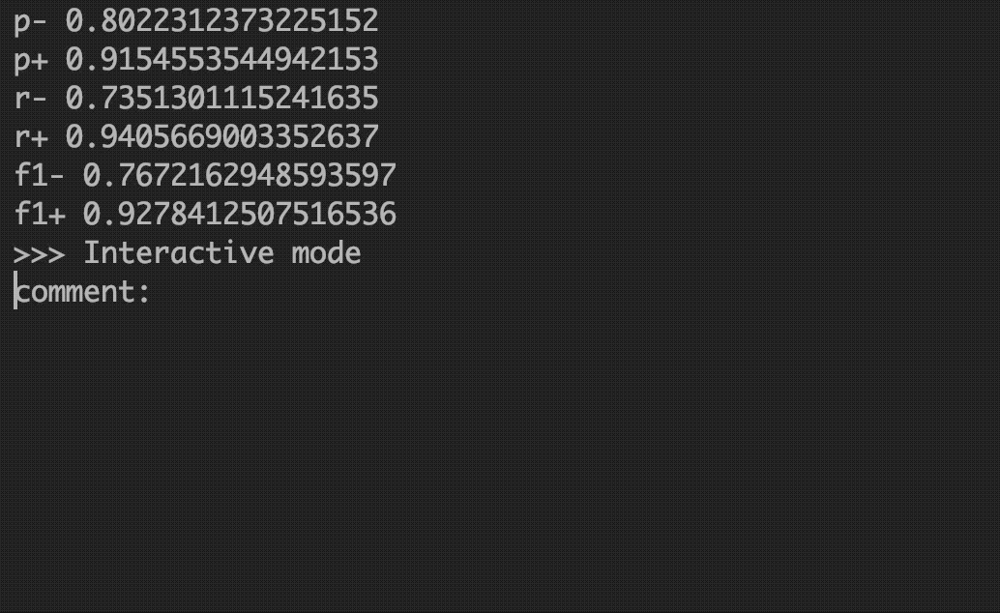

# digikala-sentiment-lstm
> 🧠Trains a simple LSTM model on the Digikala product comment dataset for the sentiment classification task




## Installation
Install `python` and `pip`. Create a `virtualenv` and activate it. Then:

```bash
$ git clone https://github.com/rajabzz/digikala-sentiment-lstm.git
$ cd digikala-sentiment-lstm
$ mkdir data
$ mkdir models
$ pip install -r requirements.txt
```
Copy your dataset to the `data` folder. If you don't have a dataset, consider using [digikala-crawler](https://github.com/rajabzz/digikala-crawler).

## Running The Program
The following command pre-processes the data, trains the LSTM model, evaluates it and starts an interactive mode for the user's manual inputs:
```bash
$ python main.py
```
In case where you need to override the default path for the raw data, use the following command:
```bash
$ python main.py --full_data_path=path/to/data.jl
```

After training, the trained model will be saved. You can use this model instead of training a new one by using the following command:
```bash
$ python main.py -t -M --data_model_ready --model_path=models/model.h5
```
For more information on other options:
```bash
$ python main.py --help
```

## License
This project is licensed under the MIT License - see the [LICENSE](LICENSE) file for details

## Task List
- [ ] Split the code into multiple files.
- [x] <del>Use `sys.argv` instead of manually changing the variables inside the code.</del>
